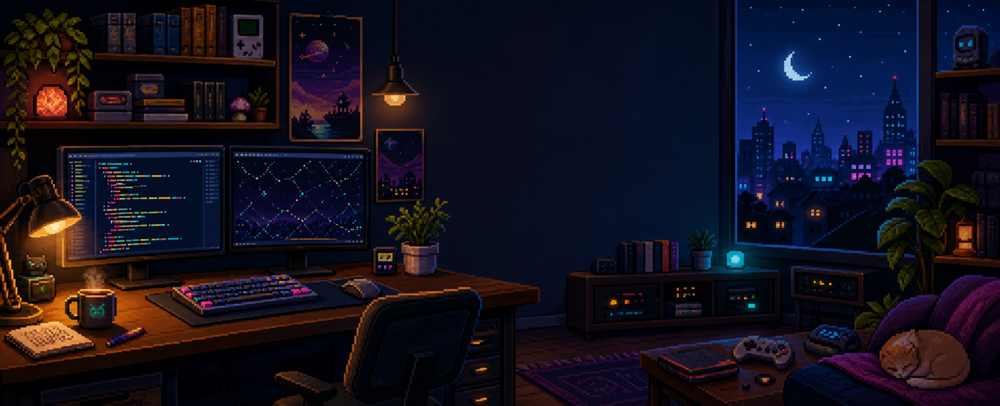
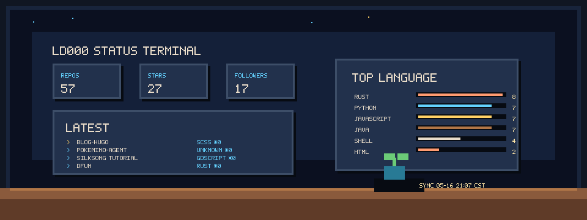
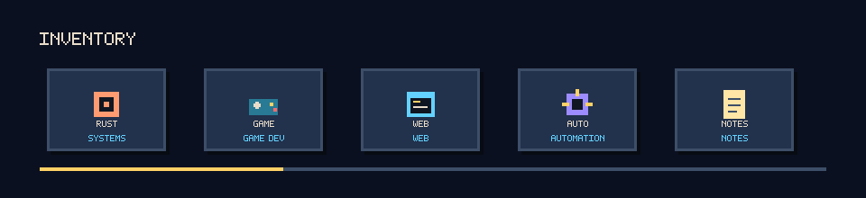
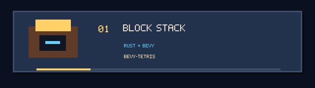
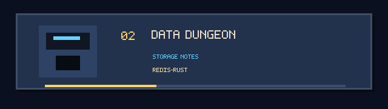
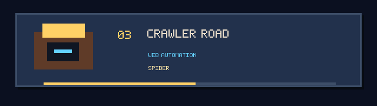
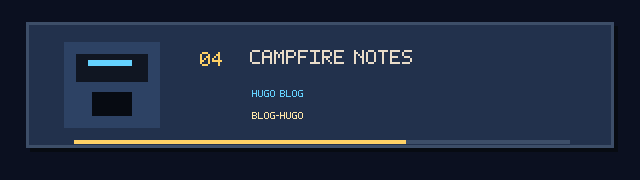

developer / side-quest engineer. Rust, game dev, web tools, automation, notes.

[Blog](https://ld000.space/) · [GitHub](https://github.com/ld000)

## Projects

<table>
  <tr>
    <td align="center" width="50%">
      <a href="https://github.com/ld000/bevy-tetris">
        
         
        <strong>bevy-tetris</strong>
      </a>
    </td>
    <td align="center" width="50%">
      <a href="https://github.com/ld000/redis-rust">
        
         
        <strong>redis-rust</strong>
      </a>
    </td>
  </tr>
  <tr>
    <td align="center" width="50%">
      <a href="https://github.com/ld000/spider">
        
         
        <strong>spider</strong>
      </a>
    </td>
    <td align="center" width="50%">
      <a href="https://github.com/ld000/blog-hugo">
        
         
        <strong>blog-hugo</strong>
      </a>
    </td>
  </tr>
</table>

May the code be with you.

