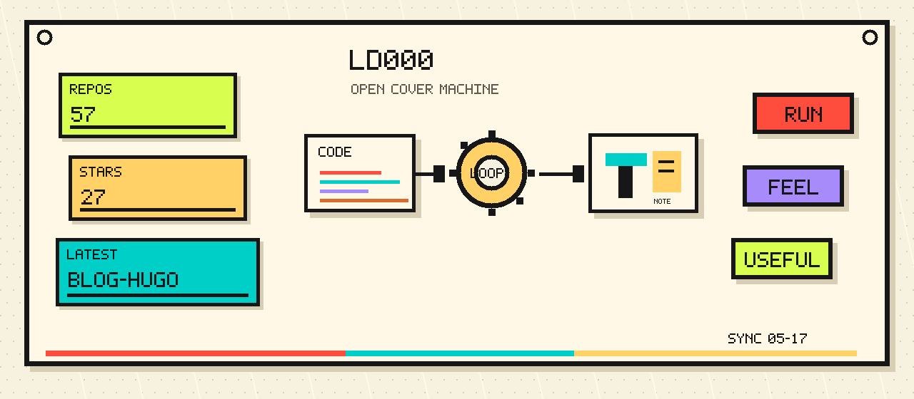
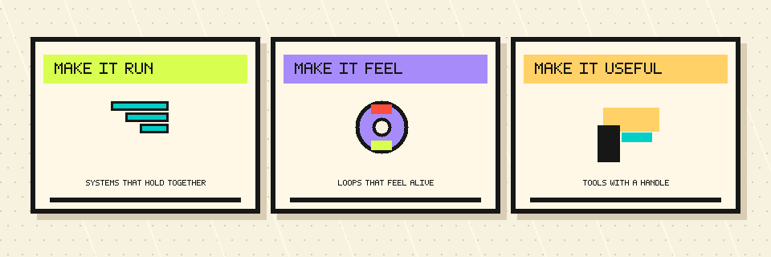

# Playable Systems

I build small machines for code, games, and notes, then leave the covers off.

[Notes & Blog](https://ld000.space/) · [Repositories](https://github.com/ld000?tab=repositories)

## Build Modes

## Selected Machines

### [bevy-tetris](https://github.com/ld000/bevy-tetris)

A small Bevy block game tuned for feel and clear state.

### [redis-rust](https://github.com/ld000/redis-rust)

Redis ideas rebuilt in Rust, one storage primitive at a time.

### [spider](https://github.com/ld000/spider)

Crawlers and web automation experiments, kept close to practical use.

### [blog-hugo](https://github.com/ld000/blog-hugo)

The Hugo notebook behind essays, field notes, and work logs.

