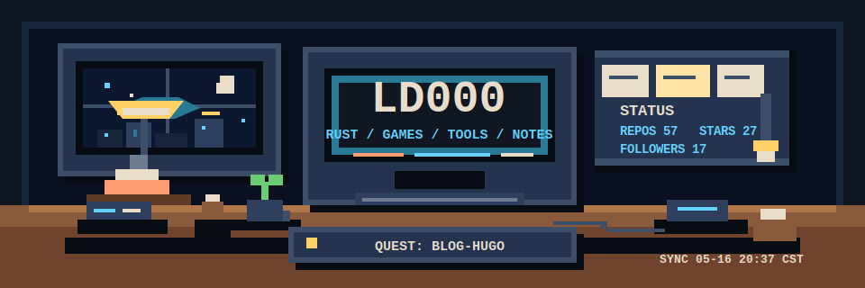
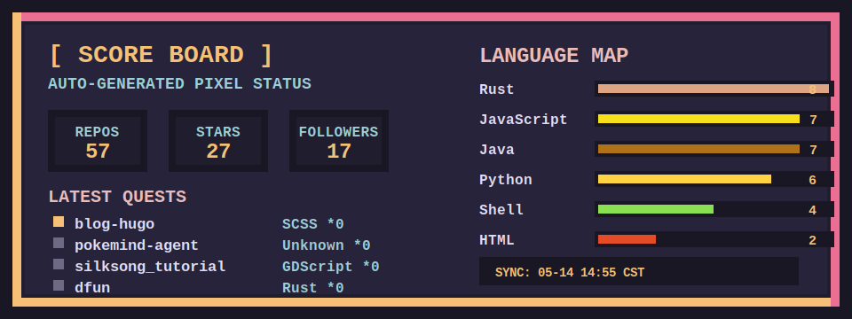

<div align="center">



[](https://ld000.space/)
[](https://github.com/ld000)

</div>

```text
PRESS START
LD000 PROFILE CARTRIDGE
CODE / NOTES / GAME DEV / SMALL TOOLS
```

## Title Screen

```text
PLAYER    ld000
CLASS     developer / side-quest engineer
BASE      Beijing, China
MOTTO     May the code be with you.

STYLE     pixel RPG mood, real-world code
MODE      build small, learn deeply, ship notes
```

## Player Card

**Main quests**

- Build useful developer tools.
- Explore game development.
- Learn systems by making tiny things.
- Keep a public trail of notes.

**Party roles**

- Rust tinkerer
- Web builder
- Automation maker
- Blog keeper

## Inventory

<p>
  
  
  
  
  
  
  
  
  
  
</p>

```text
LOADOUT
[RUST] systems, games, command-line tools
[WEB ] blogs, dashboards, small useful interfaces
[AUTO] scripts that turn chores into checkpoints
[DOCS] notes first, polish after the idea survives
```

## Stage Select

### 1-1 Block Stack

[bevy-tetris](https://github.com/ld000/bevy-tetris)

Rust + Bevy experiment with classic arcade gravity.

### 1-2 Data Dungeon

[redis-rust](https://github.com/ld000/redis-rust)

Learning storage systems by rebuilding the path.

### 2-1 Web Crawler Road

[spider](https://github.com/ld000/spider)

Crawler experiments and practical scraping notes.

### 2-2 Campfire Notes

[blog-hugo](https://github.com/ld000/blog-hugo)

The static-site engine behind the public notebook.

<details>
  <summary>Open optional GitHub stats cards</summary>

<br />

<a href="https://github.com/ld000/bevy-tetris">
  
</a>
<a href="https://github.com/ld000/redis-rust">
  
</a>

<br />
<br />

<a href="https://github.com/ld000/spider">
  
</a>
<a href="https://github.com/ld000/blog-hugo">
  
</a>

</details>

## Score Board

<div align="center">



</div>

## Save Point

**Visit**

- Blog: [ld000.space](https://ld000.space/)
- GitHub: [github.com/ld000](https://github.com/ld000)

**Next run**

```text
Keep building.
Keep writing.
Keep the pixels sharp.
```

<div align="center">

<strong>THANKS FOR VISITING - INSERT COIN TO FOLLOW</strong>

</div>
